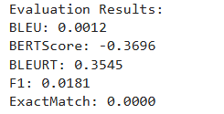

# ollama
Here is the code to work with ollama and how ollama can be used to interact with open source models locally on your machine.
The models that we are aiming to implement are:

Datasets:
1. CodeQA
2. CS1QA

Gernal purpose 
1. Llama3
    CoT_llama3_ollama.ipynb
        output_data_with_predictions.json
        Evaluation_matrices.ipynb
        
2. Mistral

Coding expert
3. deepseek-coder
4. Codellama
